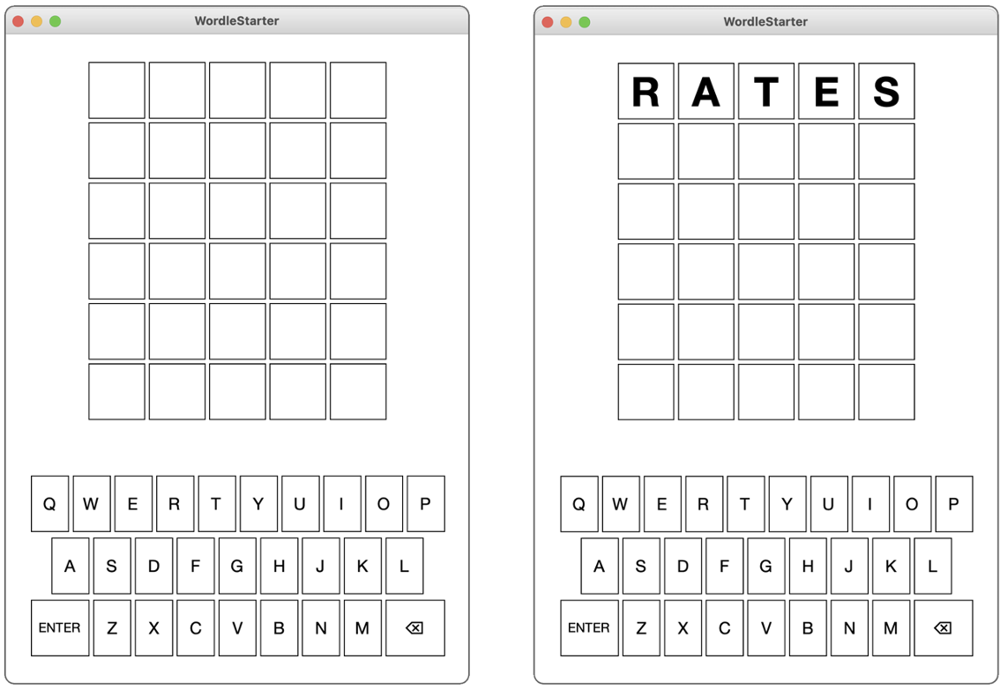
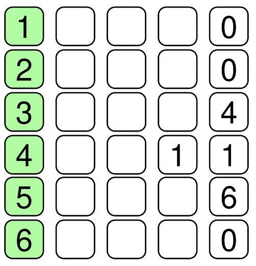

# Wordle

This is an individual assignment.

In this assignment, you will implement the Wordle game initially developed by Josh Wardle, now available on the _New York Times_ web site. Given Wordle's enormous popularity, we thought it would be fun to give you the chance to implement the game. If you are not familiar with the rules of Wordle, you may [play the game here](https://www.nytimes.com/games/wordle/index.html) and, after clicking play, click on the `?` icon at the top `>` How to Play to read the rules.

Learning goals:

- Working with an API (built-methods in the `WordleGWindow` class)
- Working with event listeners and callbacks
- Replicating a famous software game with your own code logic

## Starter files

You do not have to implement the GUI for this game; it is provided in `WordleGWindow.java`. We also provided `WordleDictionary.java` which contains a `String` array of many valid 5 letter words, and `WordleEventListener.java` which defines the interface for the callback function that will be triggered when the user hits the ENTER key (sometimes also labeled RETURN).

Your code will be written in `Wordle.java` and `WordleLogic.java`. **You should not be editing code in any other provided file.**

You should start by running the static `main` method in `Wordle.java` to see the GUI in action (type some letters and hit ENTER). You can type in letters either by hitting keys on the keyboard or clicking the keys on the screen. The figure below shows both the initial screen and the screen you get after typing in the five letters in the useful starting word RATES, which includes five of the most common letters.



Unfortunately, that's all the program does at this point. It doesn't actually let you play Wordle. That's your job. But first, it is worth spending a bit of time reviewing the rules for Wordle, in case you've somehow managed to miss this craze.

## Playing Wordle

The object of the Wordle puzzle is to figure out the hidden word for the day using no more than six guesses. When you type in a word and then hit the ENTER key, the website gives you information about how close your guess is by coloring the background of the letters.

- For every letter in your guess that is in its correct position, Wordle colors the background a light shade of green.
- For every letter that appears in the word but is not in the correct position, Wordle colors the background a brownish yellow.
- All letters in the guess that don't appear in the word are colored a medium gray.

These colors are defined in the `WordleGWindow` class, which means that you can refer to them in your program using the following constants:

```java
WordleGWindow.DEFAULT_SQUARE_COLOR

WordleGWindow.DEFAULT_KEY_COLOR

WordleGWindow.CORRECT_COLOR

WordleGWindow.PRESENT_COLOR

WordleGWindow.MISSING_COLOR
```

For example, suppose that the hidden word for the day was "RELIC", and your first guess was "RATES" as in the example above. The "R" is in the correct position, and the word contains an "E", but not in the position you guessed. The hidden word does not contain any of the letters "T", "E", and "S". Wordle reports that information by changing the background colors of the squares like this:


Even though you know the position of the "R", it doesn't make sense to guess more words beginning with "R" at this point because doing so gives you no new information. Suppose that you tried guessing the word LINGO, which contains five new letters, two of which appear in the word, but none of which are correctly positioned. Wordle responds by coloring the letter squares in your second guess as follows:


Putting these two clues together means that you know that the word begins with an "R", contains the letters "E", "L", and "I" in some order other than the one you guessed, and that the letters "A", "T", "S", "N", "G", and "O" do not appear anywhere in the word. These answers give you an enormous amount of information.

If you think carefully about it, you might find the word "RELIC", which is in fact the only English word that meets these conditions:


Done in three!

It is worth noting a few other rules and special cases. The hidden word and each of your guesses must be a real English word that is five letters long. The `WordleDictionary` class included with the starter package exports the constant `FIVE_LETTER_WORDS` as

```java
public static final String[] FIVE_LETTER_WORDS = [
    "aahed", "aalii", ... , "zoril", "zowie"
];
```

where the three dots are placeholders for more than 5000 other five-letter words.

If you guess a word that it not in the word list, Wordle displays a message to that effect, at which point you can delete the letters you've entered and try again. Another rule is that you only get six guesses. If all the letters don't match by then, Wordle gives up on you and tells you what the hidden word was.

The most interesting special cases arise when the hidden word and the guesses contain multiple copies of the same letter. Suppose, for example, that the hidden word is "GLASS" and you for some reason guess "SASSY". Wordle responds with the following colors:


The green "S" shows that there is an "S" in the fourth position, and the yellow "S" shows that a second "S" appears somewhere else in the hidden word. The "S" in the middle of "SASSY", however, remains gray because the hidden word does not contain three instances of the letter "S".

## The `WordleGWindow` class

Even though you don't have to make any changes to it or understand the details of its operation, you need to know what capabilities the `WordleGWindow` class has on offer so that you can use those facilities in your code. The methods exported by the `WordleGWindow` class are outlined in the table below. The right column of the table gives only a brief description of what these methods do. More complete descriptions appear later in this handout in the description of the milestone that requires them.

Methods exported by `WordleGWindow` class:

| new `WordleGWindow()`                     | Creates and displays the graphics window.           |
| ----------------------------------------- | --------------------------------------------------- |
| `setSquareLetter(_row_, _col_, _letter_)` | Sets the letter in the specified row and column.    |
| `getSquareLetter(_row_, _col_)`           | Returns the letter in the specified row and column. |
| `setSquareColor(_row_, _col_, _color_)`   | Sets the color of the specified square.             |
| `getSquareColor(_row_, _col_)`            | Returns the color of the specified square.          |
| `setCurrentRow(_row_)`                    | Sets the row in which typed characters appear.      |
| `getCurrentRow()`                         | Returns the current row.                            |
| `setKeyColor(_letter_, _color_)`          | Sets the color of the specified key letter.         |
| `getKeyColor(_letter_)`                   | Returns the color of the specified key letter.      |
| `addEnterListener(_listener_)`            | Specifies a listener function for the ENTER key.    |
| `showMessage(_msg_)`                      | Shows a message below the squares.                  |

## Suggested milestones

As always, whenever you are working on a programming project of any significant size, you should never try to get the entire project running all at once.

### Milestone #1: Pick a random word and display it in the first row of boxes

For your first milestone, all you have to do is choose a random word from the list provided in the `FIVE_LETTER_WORDS` constant and then have that word appear in the five boxes across the first row of the window. This milestone needs only a few lines of code, but requires you to understand what tools you have and start putting them to use. You need only edit the `enterAction(String s)` method in `Wordle.java` to accomplish this task.

For example, the `WordleGWindow` class does not export any method for displaying an entire word. All you have is a method `setSquareLetter` that puts one letter in a box identified by its row and column numbers. (Hint: use the constants `WordleGWindow.N_ROWS` and `WordleGWindow.N_COLS` whenever your code needs to know how many rows and columns exist.)

### Milestone #2: Check whether the letters entered by the user form a word

Although the starter program lets the user type letters into the Wordle game, hitting the ENTER key simply generates a message telling you that you have more to implement. The linkage between the `WordleGWindow` class and the main program occurs through a **_callback function_**, which is a function supplied by a client to a library that can later call that function to execute that operation on the client's behalf.

In this case, the main program makes the following call to register its interest in being notified whenever the user hits the ENTER key or clicks the ENTER button:

```java
gw.addEnterListener((s) -> enterAction(s));
```

The argument in this call is an example of a Java **_arrow function_** (i.e., a lambda expression), which is a convenient bit of syntax for a function definition in which the argument list appears to the left of the two-character arrow (`->`) and the body of the function appears to the right.

Note that no type declarations are required here. The Java compiler simply looks at the definition of `addEnterListener` to determine the type of function it expects. In this case, that definition tells the compiler that `addEnterListener` requires a function that takes a string and returns no value. The argument `(s) -> enterAction(s)` matches that definition and produces a function that takes a string as its argument and then calls the `enterAction` method, passing along the string `s`. The effect of this call---mysterious as its syntax may seem at first---is to trigger a call to `enterAction` whenever the user hits or click ENTER, passing the five letters on the current row as a string. The code above is more readable syntax for the following more verbose code:

```java
gw.addEnterListener(new WordleEnterListener() {
    @Override
    public void onEnter(String s) {
        enterAction(s);
    }
});
```

For Milestone #2, your job is to partially implement the `checkGuess(String guess)` method in `WordleLogic.java` and then call it from `enterAction`. The method must check to see whether the word passed from `WordleGWindow` is a legitimate English word. If it isn't, your should show the string `"Not in word list"`, which is what the _Times_ website says. If it is a word, you should display some more positive message that shows that you got this milestone running.

### Milestone #3: Color the boxes

Now you need to add code to `checkGuess` that, after checking to make sure it is a legal word, goes through updates `letterStatuses` so that the result can be used to color the boxes to show the user which letters in the guess match the word. The method you need to accomplish this task is `gw.setSquareColor(row, col, color)`.

The row and column arguments are the same as the ones you used to set or get the letters from the boxes, and `color` is the color you want to use for the background, which will typically be one of the constants `CORRECT_COLOR`, `PRESENT_COLOR`, and `MISSING_COLOR` imported from `WordleGWindow` (defined as hex code values).

The hard part of this milestone is figuring out how to color the squares, which is not as easy as it might at first appear, particularly when the hidden word contains multiple copies of the same letter. (Hint: you need to keep track of which letters in the guess have been used and cross them off as you assign colors. You also need to find the correct colors first so that you don't end up coloring a letter yellow that will later turn out to be in the correct position.)

Whenever the user enters a guess that appears in the word list, your program must do a few things. It must first check to see whether the user has correctly guessed all five letters, in case you want to have your program display some properly congratulatory message. If not, your program must move on to the next row. This information is maintained inside the `WordleGWindow` class (which needs this information to know where typed letters should appear) using the `setCurrentRow` and `getCurrentRow` methods.

### Milestone #4: Color the keys

Your next milestone implements a very helpful feature from the _New York Times_ website in which it updates the colors of the keys on the virtual keyboard, making it easy to see what letters you've already positioned, found, or determined not to be there. The `WordleGWindow` class exports the methods `setKeyColor` and `getKeyColor` to accomplish this task. These methods use the same string codes as the corresponding methods for squares.

In solving this milestone, it is important to remember that once you have set the color of a key, it won't change back (unless it's turning from yellow to green). If, for example, you've colored the "S" key green, it will never get set to yellow or gray even though you may end up using those colors for squares that contain an "S".

### Milestone 5: Keeping Score

The _New York Times_ Wordle site keeps track of the number of games you've played and presents a graph of the number of guesses you needed. The last part of this project requires you to display the counts in the Wordle grid after each finished round (either after a few seconds delay or after some user input like pressing enter again). Each row should shows the number of times you needed that many guesses. Thus, if you had solved

- four Wordle problems in three guesses,
- eleven in four guesses,
- and six in five guesses, and
- none in 6 guesses, your Wordle program should show the following display at the end:



The history of scores should be kept even if you close the application. (Hint: read/write information to a text file.)

After seeing this screen, after pressing enter, the user should be able to play another round of Wordle with a new word. To be clear, the gameplay loop is:

1. user enters letters until they guess the word or run out of guesses,
2. user sees score history,
3. the GUI is cleared (including key colors),
4. and then user may enter letters again.

### analysis.txt

In addition to your code file, please create, add, commit, push (i.e. submit) a file called `analysis.txt` that answers the following questions:

1. In one normal gameplay loop of Wordle, what is the bottleneck (the method in your implementation that takes the longest to run)? What is its run time, and as a function of what? (For example, if you say $$O(n)$$, what is $$n$$?)

2. Can you think of any ways to speed it up? Describe a brief sketch of what your code could do to remove this bottleneck.

### Thoughts to keep in mind

- As with any large program, it is essential to get each milestone working before moving on to the next. It almost never works to write a large program all at once without testing the pieces as you go.

- You have to remember that uppercase and lowercase letters are different in Java. The letters displayed in the window are all uppercase but the FIVE_LETTER_WORDS constant is an array of lowercase words. At some point, your code will have to apply the necessary case conversions.

## Extra Credit

There are many extensions you could add to the Wordle game. You may implement up to 1 point of extra credit total. Please make a comment in the header of your file if you do extra credit. Here are a few that might be fun:

- _Create a more balanced dictionary_. If you simply choose a word at random from the dictionary, some letters will appear more frequently than others in specific positions. Josh Wardle's original implementation solved this problem by keeping two sets of words: a smaller one used to select the secret word in which frequencies are more balanced and a larger one for determining whether a guess is legal. Devise a strategy for implementing this two-tiered dictionary without having to choose words by hand. (1 pt)

- _More balanced choices._ There are other strategies you can use to improve the distribution of letters in the hidden words that don't require creating a separate dictionary. For example, you could make a significant improvement simply by choosing fewer hidden words that end with the letter "s", as almost 30% of the five‑letter words do. To implement this strategy, you could define the constant `FINAL_S_FRACTION = 1 / 3` and then use that constant to accept words ending in "s" only ⅓ of the time, going back and choosing a different word the other ⅔ of the time. What other rules can you think of to help balance word choice? Add at least 5 with comments as to why you chose them. (0.5 pts)

- _Enhance the graphics when the user wins the game_. The `setSquareColor` method allows you to change the background color of a square to any color you choose. If you want to make victories more exciting, you could animate the square colors so that the letters in the correct entry cycled through the colors of the rainbow before settling to all green (0.5 pts)

- _Create an option that lists all possible words that are legal given the previous guesses._ Even though doing so is clearly cheating, some players would like to see a list of all the words remaining in the dictionary that would be acceptable given the previous set of guesses. You can trigger this option by having the user hit the ENTER key or click the ENTER button when the line is not yet finished, in which case some of the squares will contain the empty string. When this occurs, you can have your program go through all the words, check whether they conform to all the previous clues, and print those words out on the console. (0.5 pts)

- _Speed up the bottleneck._ Actually implement what you propose in Q2 of analysis.txt. (1pt)

## Grading

The gradescope autograder for this assignment is a work in progress. You are responsible for testing your own code. To help out our graders, please indicate where in your code you choose the "hidden" word to guess by labeling the line with a `/*WORD ANSWER HERE*/` comment.

| Criteria                                                                                      | Points |
| --------------------------------------------------------------------------------------------- | ------ |
| Gradescope Autograder points                                                                  | 11     |
| Handling valid/invalid word inputs                                                            | 1      |
| Coloring words & keys correctly                                                               | 3      |
| Correct gameplay loop and resetting                                                           | 3      |
| Displaying score history                                                                      | 2      |
| [Style](https://github.com/pomonacs622025fa/code/blob/main/style_guide.md), comments, JavaDoc | 1      |
| analysis.txt                                                                                  | 1      |
| **Total**                                                                                     | 22     |
| Extra credit                                                                                  | 1      |

NOTE: Code that does not compile will not be accepted! Make sure that your code compiles before submitting it.

As always, push your code to Github and submit on Gradescope.

## Credits

This assignment was adapted from one at Williamette University by Eric Roberts.
